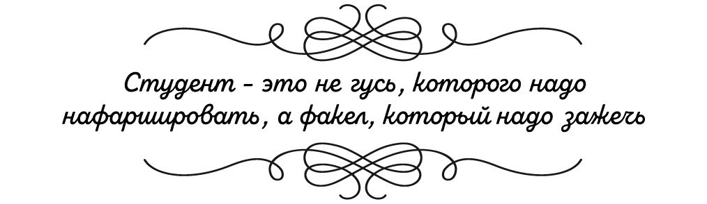
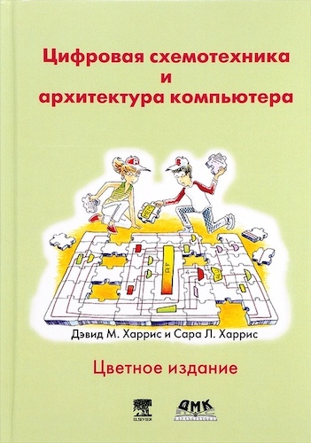
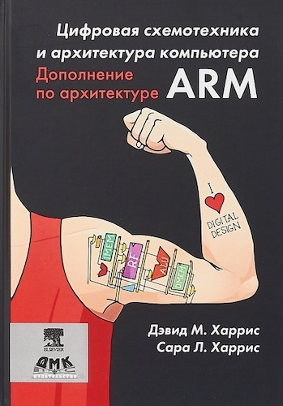
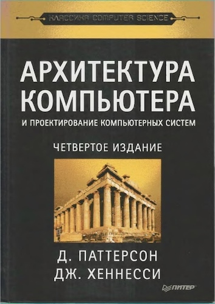
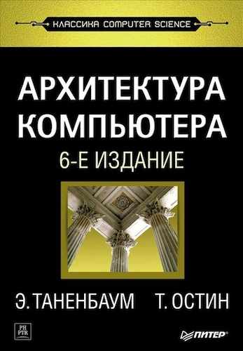
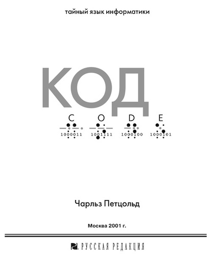
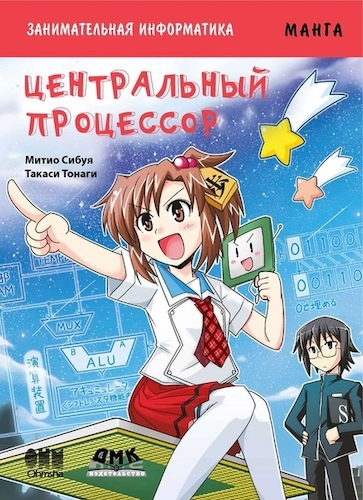

# Содержание

Привет, студент!

Данная статья – путеводитель по дисциплине «Архитектуры процессорных систем». Здесь ты найдёшь ссылки на всю информацию генерируемую в данном курсе: способы связи с преподавателями (включая анонимный), ссылку на облако, список лекций с конспектами, план лабораторных работ, используемую и дополнительную литературу, а в будущем – различные задания, популярные материалы и тому подобное.

В течение семестар информация будет обновляться и дополняться. Чтобы проще ориентироваться в новых, недавно созданных материалах, в самом начале этой статьи стоит обновляемый _комментарий_ сообщающий дату последнего изменения и указание на то, _что_ было добавлено, проще говоря — список обновлений. В дополнение к этому, ссылки на новые материалы будут дублироваться в телеграм-канале дисциплины [archps2020](https://t.me/archps2020) (для групп ПМ, ИВТ и ПИН) и [archps20](https://t.me/archps20) (для групп ИБ, РТ, ИКТ и КТ).

## Обратная связь и преподаватели

[Преподаватели АПС](other/teachers.md) - в этой статье ты найдешь информацию о всех людях задействованных в организации проведения этой дисциплины, их контакты и расписание консультаций. 

Любые комментарии, критика, жалобы, замечания, да все что угодно, что может как-то улучшить курс, или что не нравится в текущем положении вещей, обратная связь, в любой момент времени, **анонимно** —  [сюда](https://forms.gle/Y1Dtn6EWydFxxzYXA) !

## Облако ☁️

Основным хранилищем учебных и методических материалов является  [ОБЛАКО](https://1drv.ms/u/s!AlYsTGjsjfIfhP4GhdRLPQzK60vqGw?e=qKQz3L) . Постепенно количество материалов будет увеличиваться. На данный же момент в облаке находятся:

1. Презентации лекций (отдельные папки для каждого потока)
2. Методические материалы лабораторных работ
3. Вся используемая литература 
4. Установочные файлы системы автоматизированного проектирования Altera Quartus II 13.0sp1 (качаешь себе все файлы, запускаешь только QuartusSetupWeb-13.0.1.232.exe, остальное он сам подтянет), там же есть ссылка на скачивание с официального сайта, либо с torrent’ов

<!---## Экзамен (дифзачет)

- [Вопросы к экзамену](exam/questions1.md) для групп ПМ, ИВТ и ПИН
- [Вопросы к экзамену](exam/questions2.md) для групп ИБ, РТ и ИКТ
- [Вопросы к дифзачету](exam/questions3.md) для КТ
- *позже будут добавлены примеры экзаменационных задач* -->

## Материалы к лекциям ПМ, ИВТ и ПИН

Весь цикл лекций можно условно разделить на 5 основных модулей. На лекциях 1-2 разбираются **основы**, вводятся основные определения дисциплины и рассматриваются используемые инструменты. Лекции 3-5 посвящены вопросам **цифровой схемотехники**, рассматриваются способы построения различных функциональных блоков и узлов процессора. На лекциях 6-14 разбирается **архитектура и микроархитектура** процессора, а на примере архитектуры RISC-V реализуется три способа построения микроархитектуры, после чего сравниваются и обсуждаются способы повышения производительности. Лекции 16-20 посвящены **процессорным системам**, рассматриваются элементы систем в которые входит процессор и их совместное поведение. На лекциях 21-24 освещаются примеры **современных архитектур процессорных систем** обсуждаются метрики эффективности и производительности.

1. [Вводная](lect-pm/le1-intro.md)
2. [Основные концепции и инструменты](lect-pm/le2-base-and-tools.md)
3. [Цифровая арифметика. Арифметико-логическое устройство](lect-pm/le3-ALU.md)
4. [Операционные устройства](lect-pm/le4-arithmetic.md)
5. [Последовательностная логика. Память](lect-pm/le5-regfile.md)
6. [Архитектура RISC-V](lect-pm/le6-RISC-V-1.md)
7. [Программирование RISC-V](lect-pm/le7-RISC-V-2.md)
8. [Однотактный процессор](lect-pm/le8-onecicle.md)
9. [Многотактный процессор. Устройство с микропрограммным управлением](lect-pm/le9-multicicle.md)
10. [Конвейерный процессор](lect-pm/le10-pipeline.md)
11. [Конфликты конвейера](lect-pm/le11-hazard.md)
12. Методы повышения производительности
13. Виды и классификация архитектур
14. Подсистема прерываний
15. Память
16. Кэш-память
17. Виртуальная память. Операционные системы
18. Когерентность кэша. Синхронизация
19. Шины
20. Ввод/вывод
21. Микроконтроллеры (на примере PIC и ARM)
22. Системы общего назначения
23. GPU и параллельные вычисления
24. Эффективность и производительность

## Материалы к лекциям ИБ, РТ, ИКТ и КТ

Весь цикл лекций можно условно разделить на 5 основных модулей. На лекциях 1-2 разбираются **основы**, вводятся основные определения дисциплины и рассматриваются используемые инструменты. Лекции 3-4 посвящены вопросам **цифровой схемотехники**, рассматриваются способы построения различных функциональных блоков и узлов процессора. На лекциях 5-11 разбирается **архитектура и микроархитектура** процессора, а на примере архитектуры RISC-V реализуется три способа построения микроархитектуры, после чего сравниваются и обсуждаются способы повышения производительности. Лекции 12-15 посвящены **процессорным системам**, то есть акцент на функциях, видах и эффективности элементов системы, в состав которой входит процессор. На заключительной лекции рассматриваются примеры **современных архитектур процессорных систем**, обсуждаются метрики эффективности и производительности.

1. [Вводная](lect-rt/le1-intro.md)
2. [Основные концепции и инструменты](lect-rt/le2-base-and-tools.md)
3. Цифровая арифметика. Арифметико-логическое устройство
4. Последовательностная логика. Память
5. Архитектура RISC-V
6. Программирование RISC-V
7. Однотактный процессор
8. Многотактный процессор. Устройство с микропрограммным управлением
9. Конвейерный процессор и методы повышения производительности
10. Виды и классификация архитектур
11. Подсистема прерываний
12. Память
13. Кэш. Виртуальная память
14. Шины
15. Ввод\вывод
16. Микроконтроллеры (на примере PIC и ARM). Системы общего назначения

## Дополнительные материалы

[Список основных определений](other/def.md)

[Хочу под ПЛИС](other/fpga.md)

## Литература

**Дэвид М. Харрис и Сара Л. Харрис.** *Цифровая схемотехника и архитектура компьютера*
Потрясающая книга, являющаяся более доступным вариантом изложения и иллюстрации книги Архитектура компьютера и проектирование компьютерных систем, Паттерсона и Хеннесси. На примере архитектуры MIPS рассказывается как построить процессор начиная с вопросов работы транзистора. Эту книгу на чистом энтузиазме перевели на русский язык группа ученых и инженеров из стран бывшего СССР с подачи  [Юрия Панчула](http://panchul.com/about_ru/) . Вдобавок, ее электронный вариант распространяется бесплатно и абсолютно легально. Обязательна к ознакомлению каждому! Гораздо удобнее использовать печатный вариант, на этот случай ее можно приобрести  [тут](https://dmkpress.com/catalog/electronics/circuit_design/978-5-97060-522-6/) . Электронный вариант доступен в облаке.

––

**Дэвид М. Харрис и Сара Л. Харрис. ** *Цифровая схемотехника и архитектура компьютера. Дополнение по архитектуре ARM*
Как и следует из названия, эта книга дополняет предыдущую описанием отличий архитектуры ARM от MIPS, из первой книги. Книга состоит из глав, посвященных архитектуре процессоров ARM, их микроархитектуре, описанию подсистемы памяти и системы ввода-вывода. Также в приложении приведена система команд ARM. Почему такое пристальное внимание этой архитектуре? Потому что это одна из самых массово используемых архитектур в мире. Например, 98% всех мобильных телефонов работают на процессорах с архитектурой ARM. Книги в облаке нет, но ее можно приобрести  [тут](https://dmkpress.com/catalog/electronics/circuit_design/978-5-97060-650-6/) .

––

**Д. Паттерсон и Дж. Хеннесси.** *Архитектура компьютера и проектирование компьютерных систем*
Отцы архитектуры RISC делятся накополенным опытом. Не только рассказывают, как процессоры работают, но и как их построить, прививают принципы проектирования, красиво указывают на заблуждения, дают хитрые задания, да и вообще книга богата полезной информацией. Нетленка. Не зря на лицевой стороне книги написано _классика computer science_. Заканчивается книга разбором многоядерных, многопроцессорных параллельных систем. В облаке книга есть для использования исключительно в образовательных целях, а если решишь поставить к себе на полку, то придется подождать когда она  [вновь поступит в продажу](https://www.ozon.ru/context/detail/id/7425447/)  или поискать на полках магазинов.

––

**Д. Паттерсон и Дж. Хеннесси.** *Архитектура компьютера. Количественный подход*
Дополнение к предыдущей книге, вся суть которой передана в названии. Рассматривается эффективность современных вычислительных машин в численном эквиваленте. Что и как влияет на производительность вычислительных систем и какие существуют зависимости. Уделяется большое внимание построению иерархии памяти и анализу результатов, исследуется параллелизм исполнения команд. В некотором смысле это библия анализа вычислительных систем. Рекомендуется к прочтению после прослушивания курса Арихтектуры процессорных систем. В облаке лежит часть книги для ознакомления, а ее  [физическая копия](https://www.ozon.ru/context/detail/id/35204637/)  хорошо дополнит домашнюю библиотеку computer science.

––

**С.А. Орлов и Б.Я. Цилькер.** *Организация ЭВМ и систем*
Фундаментальный курс по архитектуре и структуре современных копьютерных систем, написанный двумя опытными профессорами из питерских вузов. Книга написана излишне сухо, в советской манере, порой с излишним формализмом даже там, где этого можно было избежать. Однако, книга изобилует большим объемом полезной информации, богатым списком источников, в основном зарубежных. Рекомендуется использовать ее как дополнительное справочное пособие. В ней можно найти много оригинальной информации, не содержащейся в другой отечественной печатной продукции. В облаке лежит электронная копия для ознакомления исключительно в образовательных целях. Купить книжку можно  [здесь](https://www.ozon.ru/context/detail/id/147603179/) .

––

**Д.Н. Беклемишев, А.Н. Орлов, А.Л. Переверзев, М.Г. Попов, А.В. Горячев, А.И.Кононова.** *Микропроцессорные средства и системы. Курс лекций*
Курс лекций, читавшийся несколько лет назад. На данный момент книга является актуальной, но дисциплина организована несколько иначе. Из достоинств можно выделить хорошую организацию написанного материала, представленного в виде одинаковых порций разбитых на тематические лекции. Книга доступна в облаке и в университетской библиотеке. Отдельно стоит отметить, что часть читаемого на лекциях материала представлена только в этом издании.

––

**Э. Таненбаум и Т. Остин.** *Архитектура компьютера*
Очень хорошая книга для изучения компьютерной архитектуры от всемирно известного специалиста в области информационных технологий, писателя и преподавателя, выходящая уже в шестом издании и посвящена структурной организации компьютера. В качестве примеров архитектур рассматриваются Intel Core i7, Texas Instrument OMAP4430 и Atmel ATmega168. Книга рассчитана на широкий круг читателей, так что можешь читать ее без опасения что что-то не поймешь, хотя не все с этим согласятся, некоторым книга не заходит. Чувствуется влияние того, что автор чаще взаимодействует с цифровой аппаратурой в роли программиста, а не разработчика. Вероятно это поможет в освоении материала обучающимся на соответствующих специальностях. Для ознакомления в образовательных целях книга доступна в облаке, а купить ее можно  [тут](https://www.piter.com/collection/all/product/arhitektura-kompyutera-6-e-izd-2) .

––

**Чарльз Петцольд.** *Код. Тайный язык информатики*
Книга для тех, кому плохо пошел материал. Очень, очень классно рассказывается что такое цифровые устройства, как это работает и зачем это все нужно. На примере фонариков, азбуки Морзе, шрифта Брайля и штрих-кодов автор знакомит нас с основами кодирования информации. Из лампочек и батареек сначала собираются разные вроде бы пустяковые устройства, которые позже превращаются в полноценный компьютер. Отличная популярная литература. Если ты знаешь человека, которому с трудом дается понимание цифровой техники, то ты просто обязан порекомендовать ему эту книгу. В образовательных целях можно ознакомиться с ней в облаке. Почитать восхищенный отзыв о книге и ее содержании можно  [тут](https://habr.com/ru/post/68365/) . А дождаться, когда она начнет снова продаваться можно  [тут](https://www.ozon.ru/context/detail/id/125884/) . Либо поискать в магазинах.

––

**Митио Сибуя и Такаси Тонаги.** *Центральный процессор. Образовательная манга*
Самый лайтовый вариант усвоения основных концепций изучаемой дисциплины. Про архитектуру процессора в виде ~~комикса~~ ~~манги~~ комикса. По сюжету девушка Каиураги Дюми, чемпион по японским шахматам сёги, встречает незнакомца, который предлагает ей сыграть с компьютером. Конечно же она сливает партию. И понеслось. Слово за слово и вот он уже рассказывает ей, как работает обыгравший ее компьютер. Не понять просто невозможно. А прочитав эту мангу любая книга сверху станет понятна обсалютно любому читателю. К сожалению, в облаке манга не доступна. Но она  [продается](https://dmkpress.com/catalog/manga/978-5-97060-507-3/)  как в электронном, так и в печатном виде.
